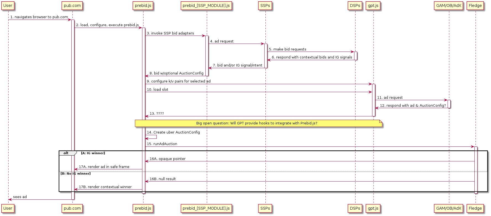

# Prebid Fledge

Prior version of this doc available [here](PrebidFledgeOld.md).

The goal of Prebid is to make the integration of Fledge and Parakeet demand seamless, at last techincally, to publishers.

Component Auctions make it possible for publishers to continue working with multiple SSPs. At a high-level, the new Prebid.js flow would look something like this:

To accommodate component auctions, the following changes are needed.

## Signal Fledge Eligibility (Step 3 & 4)
Prebid.js must determine if Interest Group bidding is eligible on the current page and in the current environment. This flag should (probably) be passed in the [`bidderRequest`](https://docs.prebid.org/dev-docs/bidder-adaptor.html#bidderrequest-parameters) parameters object and bidders will need to modify [`BidAdaptor.buildRequests()`](https://docs.prebid.org/dev-docs/bidder-adaptor.html#building-the-request).

## Pass Interst Group Signals/Intent (Step 6 & 7)
Traditionally DSPs bid or don't bid. In a Fledge world they may also respond with IG signals or some other means of indicating they wish their Interest Group bids to participate if present. DSPs and SSPs must pass through one (bids), the other (IG signals/intent), or both. This means extending the OpenRTB protocol to accommodate the passing of IG signals/intent through the chain regardless of the presence of bids (`BidResponse.ext.igbid` for example).

## Construct ComponentAuction AuctionConfig (Step 8)
In addition to passing a bid to the Prebid.js AuctionManager, they will need to construct an AuctionConfig if they wish to participate in the IG auction. It is also necessary to handle the case that they wish to participate in the Interest Group Bidding without having a contextual ad. This will require changes to the [`BidAdaptor.interpretResponse`](https://docs.prebid.org/dev-docs/bidder-adaptor.html#interpreting-the-response) function. If no AuctionConfig is present, the bidder will participate only in the contextual auction.

*Why should the SSP construct the AuctionConfig?*

The SSP knows which DSPs it has a relationship with, so it is best positioned to populate the `interestGroupBuyers` field. It can also populate the `decisionLogicUrl` uniquely for this publisher/page/etc.

## Create Uber AuctionConfig / Decision Logic (Step 14)
When all contextual bids have been received, Prebid.js needs to create an AuctionConfig for the uber auction. This AuctionConfig should contain the AuctionConfig objects for all bidders that wish to particpate via component auctions. It should also contain a link to `decisionLogicUrl` that knows how to interpret and decide between the results of the contextual auction and the component auctions. This logic will likely be simple to start, but as people grow familiar with IG Bidding it may develop more complex business models.

*Who owns the uber auction?*

This layer is effectively the auction runner for the final selection and should be run by a neutral party that is publisher aligned. In other words, it should probably be Prebid.js and not a given SSP or GAM/GPT.

# Open Questions
## How will GAM/GPT participate?
Prebid was basically a creative hack to inject other demand into GAM. It would be really, really nice to have GAM/GPT participate as a first class partner (really, really nice!).

## What does the logic for the uber auction look like?
Still TBD, though we can design that once there's agreement that the model above could work.

## 