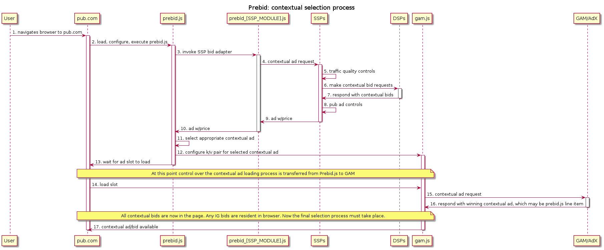
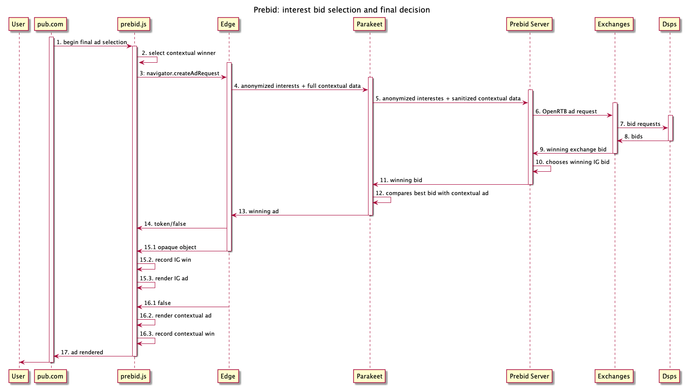

# Parakeet in Prebid.js

An exploration of the role Prebid can play in a Parakeet world.

## Parakeet and Ad Selection

While Parakeet proposes a number of changes to how ad tech will function, this document is focused on the changes to the ad selection process in the context of the browsers and its trusted server.

### Edge/Parakeet Server Becomes the Final Selection Layer

Today GAM is the final ad selection layer because it contains the publisher's direct demand, is tightly integrated with AdX, and doesn't provide a price signal externally. However, in a Parakeet world, Edge will contain interest group demand that isn't accessible via any other means and also won't provide a price signal externally. When `navigator.createAdRequest` returns a Promise it has identified an appropriate ad for rendering based on provided bids and scoring logic. As a result, the browser/Parakeet must become the final selection layer.

SSPs are used to participating in a final selection hosted elsewhere but it raises the question of how GAM will adjust to this.

<!-- The below may not be valid in Parakeet, but we should note something about the limitation of data in the contextual request and how the browser will only call a single ad tech server per ad slot

### SSP Logic Must Span Edge/Parakeet
Today SSPs are able to provide publishers with a real-time valuation of an ad slot because they have contextual and user information in one request and are able to respond with a single *best* value in response to that request.

The process of selecting the best value involves the following steps:

1) Traffic quality (TQ) - is this a legitimate request from a real user?
2) DSP qualification - which DSPs are interested in this request?
2) Bid solicitation - which DSPs will place a bid on this request?
3) Ad Quality (AQ) - which bids are eligible given the publisher's requirements?
4) Valuation - which bid is most valuable to the publisher at this moment?

This process must now be split across the SSPs and the browser (for IG bids), which means that an SSP will no longer know what an ad slot is worth in realtime (nor will the publisher).
-->

## Prebid in a Parakeet World

For the contextual ad selection process, Prebid.js can continue to function in the same manner as today. Here's what that looks like:

However, the browser will also contain user interest group memberships which could increase the value of the ad to a buyer. The Parakeet server will carefully select which IGs can be used in server side ad selection to ensure user privacy.

The Parakeet server will only make an ad request to a single ad tech partner for each ad slot. Therefore, publishers who wish to work with multiple SSPs will need to leverage a server to fan-out requests to each SSP and choose the most appropriate bid to compete with the ad server chosen contextual ad. Prebid server already performs a similar operation and could be extended to handle this responsibiliy.

## Prebid IG Flow

Here's what that looks like in a flow diagram:

1. Pub invokes final selection process in Prebid.js
2. Prebid selects/looks up contextual winner
3. Prebid invokes `navigator.createAdRequest` with winning contextual bid as the floor, maybe some other stuff
4. Edge sends request to Parakeet server including anonymized ad interests, IP Addresss, User Agent, and contextual parameters
5. Parakeet server further sanitizes the ad request and forwards to prebid server including anonymized versions of: ad interests, IP address, User Agent, and context
6. Prebid server users context (likely a stored request ID) to look up publisher configuration and send ad requests to specified exchanges with all available info (as openRTB request)
7. Exchanges make bid requests to DSPs including anonymized user/interest data
8. DSPs return bids
9. Exchanges run auction and return best bid to Prebid server
10. Prebid server evaluates all bids and chooses a single bid to return to Parakeet
11. Prebid server returns best bid to Parakeet
12. Parakeet server compares best bid from prebid server with best contextual ad
13. Parakeet server returns winning ad to Edge
14. Edge returns opaque object for rendering if winner, or returns false (if context is winner)
15. IG Bid Winner
    1. `navigator.createAdRequest` returns opaque object
    2. Prebid record IG win
    3. Prebid passes opaque object to a fenced frame for rendering
16. Context Bid Winner
    1. `navigator.createAdRequest` returns false
    2. Prebid renders contextual ad
    3. Prebid records contextual win
17. Ad has rendered

As can be seen in the sequence diagram above, the Parakeet API is invoked by Prebid which is also responsible for constructing the arguments.

## Open Questions

**1. Who operates the parakeet server and can all parties trust them?**

The default operator in the proposal seems to be the browser vendor, who primarily represents and is trusted by the user. However, Buyers and Sellers will need to trust the Parakeet server to protect their proprietary data from being leaked. The [Garuda](https://darobin.github.io/garuda/) proposal provides a possible governance/trust model but Microsoft has not committed to something like this and it may be up to each browser vendor to make their own decision on how to run a trusted server.

**2. How will GAM interact with the Parakeet API?**

How will GAM integrate into the final selection layer in the browser and will it help or hinder SSPs? If GAM were to provide an an API/adapter that integrated with Prebid.js this would be a good thing. If, on the other hand, GAM provides a tag library that directly invokes `navigator.createAdRequest` without allowing other SSPs to participate this would be bad.

## Where Are We?

The Parakeet workflow fits much easier into the way adtech works today. DSPs and SSPs can continue to operate server-side decisioning based on available data at ad-request time. However, the quantity and granularity of data available in Parakeet will have to be lower than would could be available in something like Turtledove/Fledge.
