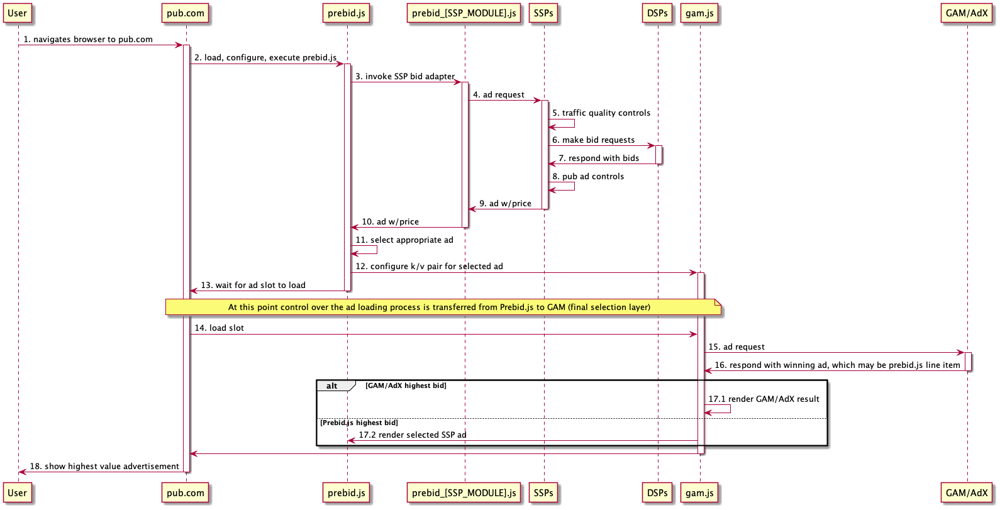
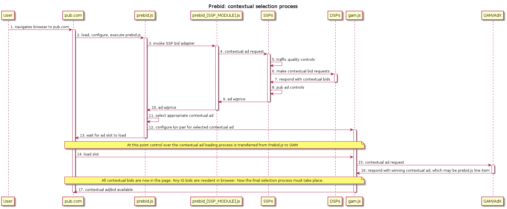
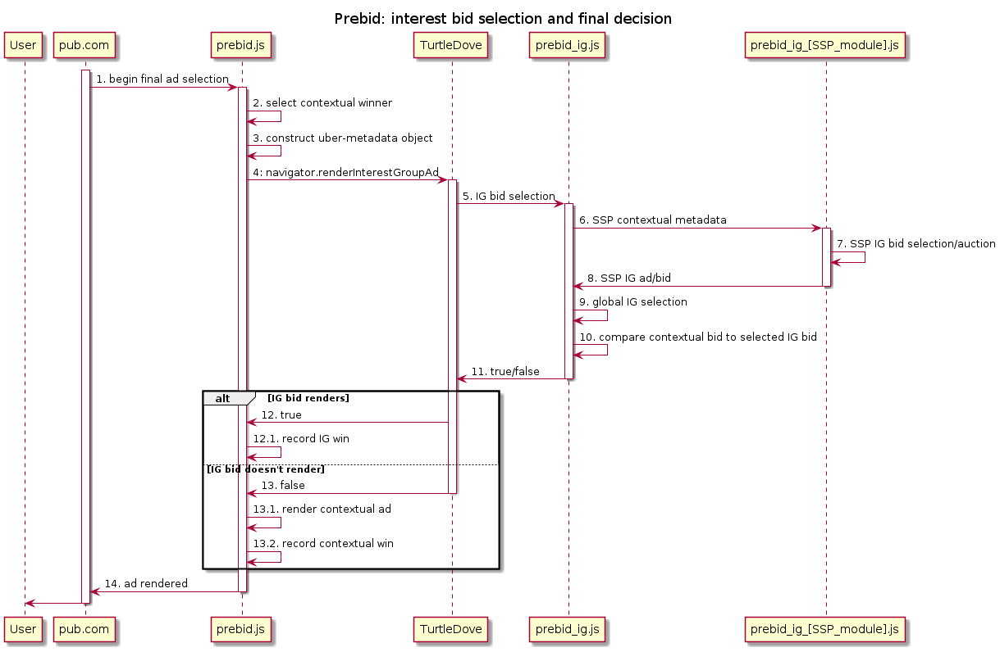

# prebid-td
An exploration of the role Prebid can play in a TurtleDove world.

# Birth of Header Bidding
As DFP (now GAM) became the dominant ad server (and included tight AdX integration) publishers wanted a way to have other demand sources compete in the GAM/AdX ad selection process. While GAM/AdX didn't provide an API to do this, publishers did have the ability create their own line items in DFP that were considered in the selection process. Futhermore, they could activate these line items based on key/value pairs added to the DFP tag invocation. The final step was figuring out how to solicit an independent SSP and map their bid to the right key/value. Soliciting the SSP in the header of the page allowed the bid to be retrieved and mapped to a key/value before the DFP ad slot was fetched. And thus header bidding was born.

# Birth of Prebid.js
Publishers saw a significant benefit from having a single SSP compete with DFP/AdX and the logical next step was to have multiple SSPs compete. While SSPs provided libraries that made it easy to do header bidding, they all had their own implementation and they weren't designed to work well together. Furthermore, there were different strategies for creating line items, mapping K/V pairs to line items, naming line items, and the creative that triggered the serving of a cached SSP creative. Very sophisticated publishers were capable of writing their own javascript solutions that managed these complexities, as well as paying for AdOps folks to manage the setup in DFP, but it was error prone and expensive. Prebid.js provided a standardized way of integrating with DFP, the publisher's page, and SSPs (who provided adapters that mapped their ad calls and bids to the Prebid standard).

# Why Prebid.js works
## ... for Publishers
Publishers (and adtech in general) must contend with the fact that ad selection happens at multiple levels. DSPs perform ad selection from among all eligible campaigns they represent. SSPs perform ad selection from all DSPs that responded to a bid request. A publisher does selection from among all SSPs that responded to it. Prebid.js works because SSPs are able to provide publishers with a realtime signal of what an ad slot is worth.

However, GAM does not provide this information to a publisher in realtime - it merely runs an auction and returns the winning ad. Due to this lack of price signal GAM must necessarily be the final level of ad selection.

*Header bidding/Prebid.js has been extremely successful because it provides a way to funnel SSP price signals into the final selection layer.* It enabled publishers to retain control of their business models without being beholden to a single technology vendor (to some extent).

**Prebid.js works for publishers because it enables greater competition and avoids vendor lock-in.**

## ... for SSPs
Any entity in competition with another entity wants to know that the playing field is level - it does not unfairly advantage a competitor. Prebid.js provides this assurance to SSPs in several ways:

First, the code that runs the on-page auction is open-source and also running in the open simply by virtue of the way javascript on the browser works (obfuscation not withstanding). This is a very high level of transparency.

Second, SSPs can develop their own adapters. The part of Prebid.js that is SSP specific is under the control of the SSP itself (though still open-source). SSPs can develop their own adapters to function optimally in the Prebid.js world.

Third, Prebid.js is run by an independent organization that has representation from various SSPs. This provides assurance that participants will be held accountable for their actions.

In short, **Prebid.js works for SSPs because there is transparency, control, and accountability.**

# Prebid.js Today
This sequence diagram attempts to illustrate how Prebid.js functions on a publisher's page today:



1. A user navigates to a publisher site
2. The publisher page loads and configures prebid.js
3. prebid.js invokes SSP adapter for participating SSPs
4. SSP adapter issues an ad request to the SSP
5. SSPs do traffic quality evaluation (and may short circuit if they deem the traffic fraudulent).
6. SSPs solicit bids from eligible and interested DSPs
7. DSPs respond with bids
8. SSPs filter bids based on pub controls (e.g. ad quality)
9. SSPs responds to the page/SSP adapter with a creative and a value.
10. SSP adapter responds to Prebid.js with the SSPs creative and a value.
11. Prebid.js selects the appropriate ad (may be auction, may not be)
12. Prebid.js configures the appropriate k/v pairs for the selected ad
13. Prebid.js returns control the page, where the pub initiates the loading of the GAM slot
14. GAM ad tag is invoked.
15. GAM ad tag calls GAM (and AdX, not OB due to their policies)
16. GAM runs the final selection process, which includes line items activated by Prebid.js
17. GAM creative is rendered regardless of outcome, but what is in that creative will vary:
  - [GAM/AdX winner] In this situation the rendered ad tag is a creative sent via GAM/AdX.
  - [Prebid.js winner] In this case the tag rendered from GAM was associated with a Prebid.js lineitem and it calls back into Prebid.js to render the earlier selected creative.

While it is a technical detail to show the invocation of the `prebid_[SSP_MODULE].js` in the sequence diagram above, it's there to illustrate the principle of SSP involvement and code control in the context of the greater auction that occurs.

Hopefully this diagram helps show how a Publisher using Prebid.js is able to integrate other SSPs into GAM.

# TurtleDove and Ad Selection 
While TurtleDove proposes a number of changes to how ad tech will function this document is focused on the changes to the ad selection process in the context of the browser.

## 1. Chrome/TurtleDove Becomes the Final Selection Layer
Today GAM is the final ad selection layer because it contains the publisher's direct demand, is tightly integrated with AdX, and doesn't provide a price signal externally. However, in a TurtleDove world, Chrome will contain interest group demand that isn't accessible via any other means and won't provide a price signal externally. Additionally, if ```navigator.renderInterestGroupAd``` returns 'true' it has also taken the non-reversible action of rendering an ad. As a result, the browser/TurtleDove must become the final selection layer.

SSPs are used to participating in a final selection hosted elsewhere but it raises the question of how GAM will adjust to this.

## 2. SSP Logic Must Span Chrome/TurtleDove
Today SSPs are able to provide publishers with a realtime valuation of an ad slot because they have contextual and user information in one request and are able to respond with a single *best* value in response to that request.

The process of selecting a best value involves the following steps:
1) Traffic quality (TQ) - is this a legitimate request from a real user?
2) DSP qualification - which DSPs are interested in this request?
2) Bid solicitation - which DSPs will place a bid on this request?
3) Ad Quality (AQ) - which bids are eligible given the publisher's requirements?
4) Valuation - which bid is most valuable to the publisher at this moment?

This process must now be split across the SSPs and the browser (for IG bids), which means that an SSP will no longer know what an ad slot is worth in realtime (nor will the publisher).

# Prebid.js in a TurtleDove World
For the contextual ad selection process, Prebid.js can continue to function in the same manner as today. Here's what that looks like:



However, the browser will also contain bids that are targeted at Interest Groups. These bids cannot escape the TurtleDove sandbox, which means that logic to choose between them must be sent into TurtleDove.

There are two parts to the logic that must be sent into TurtleDove:
1) Prebid IG controller - the script that runs the overall IG bid selection process
2) Prebig IG SSP adapters - the SSP implemented functionality to choose from among an SSP's IG bids

## Prebid IG SSP Adapter
In the same way that an SSP implements an adapter to integrate with Prebid.js, an SSP will need to implement an adapter that selects from the IG based bids that it owns. This entails implementing some of the logic noted above:

* Bid targeting - which bids are eligible to participate based on advertiser targeting?
* Context targeting - which bids are eligible to participate based on pub restrictions?
* Valuation - does the current context influence the value of these bids? Are there Deals or Private Marketplace rules in effect?

In order to do this selection process the SSP adapter needs to have the contextual information passed in, including the publisher's restrictions and any active business models. The IG bids also need to contain any advertiser restrictions so that those can be evaluated given the current context. In the past all this information stayed within the SSP but for ad selection to be completed in TurtleDove the information must be sent to the browser.

## Prebid IG Controller
The Prebid IG controller must receive the winning contextual bid (already chosen by Prebid.js) and all the SSP specific metadata. The controller passes the SSP metadata to the SSP IG adapter and receives a bid (or none) from the SSP adapter. The IG Controller then compares the results from all the SSP IG Adapters and chooses a winner. Finally, the IG Controller compares the contextual winner to the IG winner. If an IG winner exists and is higher than the contextual winner, the ad is rendered and the result of ```navigator.renderInterestGroupAd``` is ```true```. If the contextual winner has the higher value then ```false``` is returned and the overall Prebid.js script renders the contextual ad.

## Prebid IG Flow
Here's what that looks like in a flow diagram:



# EOM / scratch beyond this point

While the TurtleDove author has stated the goal is that TurtleDove execute a local auction over SSP demand ([#73](https://github.com/WICG/turtledove/issues/73)), I don't see how this is possible without provding an API that returns a price signal back to the SSP without rendering an ad. An example of what this might look like:

```javascript
// This can be thought of as an OpenRTB Bid Response (to the original contextual
// bid request).
let sspContextualOrtbBidResp = {
    "adm": "...creative html...",
    "price": 1.5,
    ...
}

// This could be thought of as an OpenRTR Bid Request, since the meta-data passed 
// in is likely to be very similar to the original contextual bid request.
let sspOrtbBidReq = {
    "site": {
        "ref": "https://reverb.com/",
        "publisher": {
            ...
        }
    }
    ...
}

// This could be thought of as an OpenRTB Bid Request to an SSP's bid cache on the
// browser. The browser responds with a structure that includes an opaque pointer
// (for rendering of the ad later should the winner be an IG ad) and the value
// of the browser's auction resolution, which would be max(contextual bid, IG bids).
let sspRealtimeResultPtr = navigator.resolveInterestGroupAd(sspContextualOrtbBidResp, sspOrtbBidReq)
```

At this point the SSP would know the value they provide to the publisher in realtime and could wrap this logic in their Prebid.js adapter and Prebid.js would function as it does today.

However, TurtleDove views an IG based bid price to be a privacy escape vector so this approach isn't feasible. While this model was a nice thought exercise demonstrating how an SSP might function in a TurtleDove world if an SSP scoped decision was possible, I think we need to assume that it's not.

## Where are we?
Some fraction of the demand is locked behind the TurtleDove curtain, we can't get a price signal out from behind the curtain, and publisher's need to stay in control of their business models while integrating different demand sources.

This is remarkably similar to the GAM/AdX situation discussed before. We need a solution that allows publishers to own their business model, SSPs to control the logic specific to the demand they represent, and a way to do so in a blackbox environment.

# Open Questions
This raises the question of how GAM will integrate into the final selection layer in the browser and if it will help or hinder SSPs. If GAM were to provide an an API/adapter that integrated with Prebid.js this would be a good thing. If, on the other hand, GAM provides a tag library that directly invokes navigator.renderInterestGroupAd without allowing other SSPs to participate this would be bad.