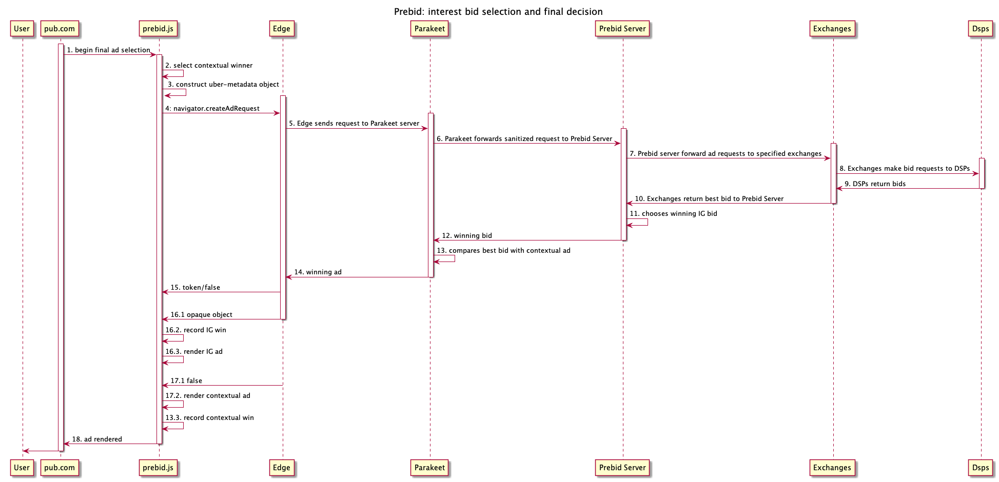

# Parakeet in Prebid.js

An exploration of the role Prebid can play in a Parakeet world.

## Birth of Header Bidding

As DFP (now GAM) became the dominant ad server (and included tight AdX integration) publishers wanted a way to have other demand sources compete in the GAM/AdX ad selection process. While GAM/AdX didn't provide an API to do this, publishers did have the ability create their own line items in DFP that were considered in the selection process. Futhermore, they could activate these line items based on key/value pairs added to the DFP tag invocation. The final step was figuring out how to solicit an independent SSP and map their bid to the right key/value. Soliciting the SSP in the header of the page allowed the bid to be retrieved and mapped to a key/value before the DFP ad slot was fetched. And thus header bidding was born.

## Birth of Prebid.js

Publishers saw a significant benefit from having a single SSP compete with DFP/AdX and the next step was to have multiple SSPs compete. While SSPs provided libraries that made it easy to do header bidding, they all had their own implementation and they weren't designed to work well together. Furthermore, there were different strategies for creating line items, mapping K/V pairs to line items, naming line items, and the creative that triggered the serving of a cached SSP creative. Very sophisticated publishers were capable of writing their own javascript solutions that managed these complexities, as well as paying for AdOps folks to manage the setup in DFP, but it was error prone and expensive. Prebid.js provided a standardized way of integrating with DFP, the publisher's page, and SSPs (who provided adapters that mapped their ad calls and bids to the Prebid standard).

## Side Note: Why Multiple SSPs?

Since most SSPs are integrated with the same demand sources, one might ask what benefit there is to integrating with multiple SSPs. The drawbacks are management overhead (for the pubs), duplicated requests (for the DSPs), and extra browser load/latency (for the end users). But publishers did see a significant benefit from having multiple SSPs and there's a good reason for that.

In a perfectly efficient exchange all demand would be submitted to a single auction where a global decision would be made. Unfortunately, most exchanges (ad or otherwise) are far from perfectly efficient. One of the big inefficiencies in programmatic ad exchanges is the way DSPs and SSPs respond with a single bid to a given request. While DSPs are representing many different campaigns, when responding to a bid request from an SSP they run an internal selection process and respond with a single bid on behalf of one of these campaigns. The SSPs receive single bids from a number of different DSPs, then select a winner and respond with that to the next level of auction (the prebid auction). The result is that at each tier of the auction process demand gets lost, which leads to inefficient markets.

Soliciting multiple SSPs had positive results because it exposed more bids. While it's possible that the DSPs are responding with the exact same bids to every SSP, it's highly unlikely. The increased bid density provided a better financial outcome for publishers.

There are also other reasons that not all SSPs represent the same DSP demand. Some of those are:
* Deals/PMPs may be transacted through a single SSP
* DSPs may have negotiated different rates with certain SSPs
* SSPs may not all handle the same type of inventory

There are many reasons why a Publisher is best served by working with multiple SSPs.

### Side-side Note: First Price Auction (1PA) vs. Second Price Auction (2PA)

At the advent of programmatic advertising the auctions all used a second price strategy. More recently the industry has transitioned to a first price auction strategy. I believe there are two reasons for this:
1. When multiple layers of auction are happening, if the first layer is a second price auction you can't reason about how your bid will perform in the final layer.

A first price auction means that the bid value essentially stays the same at all selection layers (minus fees) which makes it easier to reason about how your bid will perform regardless of what layer of auction/selection it is competing in.

2) Second price auctions are only truly effective when bid density is high enough.

With DSPs submitting a single bid from all their demand, the density is often not high enough to get a sense of true value, which means pubs must resort to different flooring tactics to avoid being cherry picked.

If the industry wants to return to a second price auction dynamic, then DSPs will need to submit more bids to SSPs, and SSPs may also need to submit more bids to the final decision layer. This will insure that the bid density is high enough for a true value to be determined.

## Why Prebid.js Works

### …for Publishers

Publishers (and adtech in general) must contend with the fact that ad selection happens at multiple levels. DSPs perform ad selection from among all eligible campaigns they represent. SSPs perform ad selection from all DSPs that responded to a bid request. A publisher does selection from among all SSPs that responded to it. Prebid.js works because SSPs are able to provide publishers with a realtime signal of what an ad slot is worth.

However, GAM does not provide this information to a publisher in realtime - it merely runs an auction and returns the winning ad. Due to this lack of price signal GAM must necessarily be the final level of ad selection.

*Header bidding/Prebid.js has been extremely successful because it provides a way to funnel SSP price signals into the final selection layer.* It enabled publishers to retain control of their business models without being beholden to a single technology vendor (to some extent).

**Prebid.js works for publishers because it enables greater competition and avoids vendor lock-in.**

### …for SSPs

Any entity in competition with another entity wants to know that the playing field is level - it does not unfairly advantage a competitor. Prebid.js provides this assurance to SSPs in several ways:

First, the code that runs the on-page auction is open-source and also running in the open simply by virtue of the way javascript on the browser works (obfuscation not withstanding). This is a very high level of transparency.

Second, SSPs can develop their own adapters. The part of Prebid.js that is SSP specific is under the control of the SSP itself (though still open-source). SSPs can develop their own adapters to function optimally in the Prebid.js world.

Third, Prebid.js is run by an independent organization that has representation from various SSPs. This provides assurance that participants will be held accountable for their actions.

**In short, Prebid.js works for SSPs because there is transparency, control, and accountability.**

## Prebid.js Today

This sequence diagram attempts to illustrate how Prebid.js functions on a publisher's page today:

1. A user navigates to a publisher site
2. The publisher page loads and configures prebid.js
3. prebid.js invokes SSP adapter for participating SSPs
4. SSP adapter issues an ad request to the SSP
5. SSPs do traffic quality evaluation (and may short circuit if they deem the traffic fraudulent).
6. SSPs solicit bids from eligible and interested DSPs
7. DSPs respond with bids
8. SSPs filter bids based on pub controls (e.g. ad quality)
9. SSPs responds to the page/SSP adapter with a creative and a value.
10. SSP adapter responds to Prebid.js with the SSPs creative and a value.
11. Prebid.js selects the appropriate ad (may be auction, may not be)
12. Prebid.js configures the appropriate k/v pairs for the selected ad
13. Prebid.js returns control the page, where the pub initiates the loading of the GAM slot
14. GAM ad tag is invoked.
15. GAM ad tag calls GAM (and AdX, not OB due to their policies)
16. GAM runs the final selection process, which includes line items activated by Prebid.js
17. GAM creative is rendered regardless of outcome, but what is in that creative will vary:
  - [GAM/AdX winner] In this situation the rendered ad tag is a creative sent via GAM/AdX.
  - [Prebid.js winner] In this case the tag rendered from GAM was associated with a Prebid.js lineitem and it calls back into Prebid.js to render the earlier selected creative.

While it is a technical detail to show the invocation of the `prebid_[SSP_MODULE].js` in the sequence diagram above, it's there to illustrate the principle of SSP involvement and code control in the context of the greater auction that occurs.

Hopefully this diagram helps show how a Publisher using Prebid.js is able to integrate other SSPs into GAM.

## Parakeet and Ad Selection

While Parakeet proposes a number of changes to how ad tech will function, this document is focused on the changes to the ad selection process in the context of the browsers and its trusted server.

### Edge/Parakeet Server Becomes the Final Selection Layer
Today GAM is the final ad selection layer because it contains the publisher's direct demand, is tightly integrated with AdX, and doesn't provide a price signal externally. However, in a Parakeet world, Edge will contain interest group demand that isn't accessible via any other means and also won't provide a price signal externally. When `navigator.createAdRequest` returns a Promise it has identified an appropriate ad for rendering based on provided bids and scoring logic. As a result, the browser/Parakeet must become the final selection layer.

SSPs are used to participating in a final selection hosted elsewhere but it raises the question of how GAM will adjust to this.

<!-- The below may not be valid in Parakeet, but we should note something about the limitation of data in the contextual request and how the browser will only call a single ad tech server per ad slot

### SSP Logic Must Span Edge/Parakeet
Today SSPs are able to provide publishers with a real-time valuation of an ad slot because they have contextual and user information in one request and are able to respond with a single *best* value in response to that request.

The process of selecting the best value involves the following steps:

1) Traffic quality (TQ) - is this a legitimate request from a real user?
2) DSP qualification - which DSPs are interested in this request?
2) Bid solicitation - which DSPs will place a bid on this request?
3) Ad Quality (AQ) - which bids are eligible given the publisher's requirements?
4) Valuation - which bid is most valuable to the publisher at this moment?

This process must now be split across the SSPs and the browser (for IG bids), which means that an SSP will no longer know what an ad slot is worth in realtime (nor will the publisher).
-->

## Prebid in a Parakeet World
For the contextual ad selection process, Prebid.js can continue to function in the same manner as today. Here's what that looks like:

However, the browser will also contain user interest group memberships which could increase the value of the ad to a buyer. The Parakeet server will carefully select which IGs can be used in server side ad selection to ensure user privacy.

The Parakeet server will only make an ad request to a single ad tech partner for each ad slot. Therefore, publishers who wish to work with multiple SSPs will need to leverage a server to fan-out requests to each SSP and choose the most appropriate bid to compete with the ad server chosen contextual ad. Prebid server already performs a similar operation and could be extended to handle this responsibiliy.
## Prebid IG Flow
Here's what that looks like in a flow diagram:

1. Pub invokes final selection process in Prebid.js
2. Prebid selects/looks up contextual winner
3. Prebid invokes `navigator.createAdRequest` with winning contextual bid as the floor, maybe some other stuff
4. Edge sends request to Parakeet server including anonymized ad interests, IP Addresss, User Agent, and contextual parameters
5. Parakeet server further sanitizes the ad request and forwards to prebid server including anonymized versions of: ad interests, IP address, User Agent, and context
6. Prebid server users context (likely a stored request ID) to look up publisher configuration and send ad requests to specified exchanges with all available info (as openRTB request)
7. Exchanges make bid requests to DSPs including anonymized user/interest data
8. DSPs return bids
9. Exchanges run auction and return best bid to Prebid server
10. Prebid server evaluates all bids and chooses a single bid to return to Parakeet
11. Prebid server returns best bid to Parakeet
12. Parakeet server compares best bid from prebid server with best contextual ad
13. Parakeet server returns winning ad to Edge
14. Edge returns opaque object for rendering if winner, or returns false (if context is winner)
15. IG Bid Winner
    1. `navigator.createAdRequest` returns opaque object
    2. Prebid record IG win
    3. Prebid passes opaque object to a fenced frame for rendering
16. Context Bid Winner
    1. `navigator.createAdRequest` returns false
    2. Prebid renders contextual ad
    3. Prebid records contextual win
17. Ad has rendered

As can be seen in the sequence diagram above, the Parakeet API is invoked by Prebid which is also responsible for constructing the arguments.

## Open Questions

**1. Who operates the parakeet server and can all parties trust them?**

The default operator in the proposal seems to be the browser vendor, who primarily represents and is trusted by the user. However, Buyers and Sellers will need to trust the Parakeet server to protect their proprietary data from being leaked. The [Garuda](https://darobin.github.io/garuda/) proposal provides a possible governance/trust model but Microsoft has not committed to something like this and it may be up to each browser vendor to make their own decision on how to run a trusted server.

**2. How will GAM interact with the Parakeet API?**

How will GAM integrate into the final selection layer in the browser and will it help or hinder SSPs? If GAM were to provide an an API/adapter that integrated with Prebid.js this would be a good thing. If, on the other hand, GAM provides a tag library that directly invokes `navigator.createAdRequest` without allowing other SSPs to participate this would be bad.

## Where Are We?

The Parakeet workflow fits much easier into the way adtech works today. DSPs and SSPs can continue to operate server-side decisioning based on available data at ad-request time. However, the quantity and granularity of data available in Parakeet will have to be lower than would could be available in something like Turtledove/Fledge.
